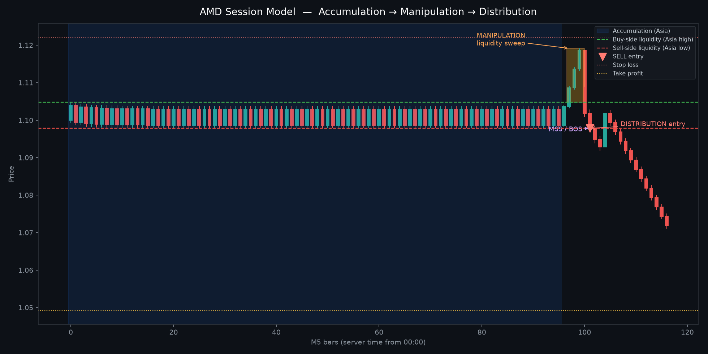

# SMC Strategy Bot — Session AMD Expert Advisor

MetaTrader 5 Expert Advisor that trades the **Accumulation → Manipulation → Distribution** (AMD / ICT Power of 3) session model.

Price is not treated as a random up/down stream. The EA first maps the overnight range, waits for a real liquidity sweep of that range, then requires a market-structure shift before it will enter the distribution leg.



## Strategy in one sequence

1. **Accumulation (Asia)** — build and freeze the session high/low, range, and resting liquidity.
2. **Manipulation (typically London)** — wait for price to actually pierce buy-side or sell-side liquidity. A touch of the level is not a trade.
3. **Confirmation** — rejection back inside/through the level, then a lower-timeframe break of structure / CISD.
4. **Distribution** — enter with HTF bias agreement, SL beyond the sweep extreme, TP by risk/reward and/or the next liquidity pool.
5. **One cycle, one idea** — after a valid setup is taken (or rejected for risk), wait for the next accumulation session.

The EA does **not** assume that every session high or low will be swept, and it does **not** enter on a sweep without confirmation.

## Install in MetaTrader 5

1. Open MT5 → **File → Open Data Folder**.
2. Copy `MQL5/Experts/AMD_Session_EA.mq5` into `MQL5/Experts/`.
3. Copy the `MQL5/Include/AMD/` folder into `MQL5/Include/AMD/`.
4. Restart MT5 (or right-click Navigator → Refresh).
5. Compile `AMD_Session_EA.mq5` in MetaEditor.
6. Attach it to the chart you want to trade (M5 or M15 recommended as the display chart). The EA reads **H1** for bias and **M5** for entries regardless of the chart period, and both timeframes are inputs.

Session hours are **broker server time**. If your broker is GMT+2 in winter / GMT+3 in summer, the defaults (Asia `00:00–08:00`, London `08:00–12:00`, New York `12:00–17:00`) match the common ICT map. Shift the inputs if your server is different.

## Default session map (server time)

| Session | Default window | Role |
| --- | --- | --- |
| Asia | 00:00 – 08:00 | Accumulation range |
| London | 08:00 – 12:00 | Manipulation / Judas swing (entries allowed) |
| New York | 12:00 – 17:00 | Distribution continuation (entries allowed) |

## What must be true before a trade

**BUY**

1. Accumulation range is valid.
2. Price sweeps **below** the range low (sell-side liquidity).
3. Price fails and closes back inside/through that low.
4. Bullish structure confirms (BOS / CISD, optional rejection + displacement).
5. HTF bias filter agrees (if enabled).
6. Spread, ATR, session, SL-distance, and trade-count filters pass.
7. SL is placed below the manipulation low. TP uses RR, liquidity, or hybrid.

**SELL** — the inverse against the accumulation high.

A bar that only tags the Asia high/low is ignored. A sweep that never confirms is ignored. Taking the opposite side of the range **after** a rejected sweep is treated as the distribution target, not as a new opposite setup.

## Inputs (all strategy parameters)

Every behaviour below is an EA input. You do not need to edit source to change it.

### General
- Magic number, order comment, allow BUY, allow SELL
- Evaluate on new LTF bar only
- Debug journal prints

### Sessions
- Asia / London / New York start and end (hour + minute)
- Trade during London, trade during New York
- Flatten on Friday from a chosen hour

### Timeframes and structure
- Higher timeframe (bias), lower timeframe (sweeps / MSS / entry)
- HTF / LTF lookback
- Fractal swing strength
- Equal high/low lookback and tolerance
- HTF bias mode: off / with-trend / counter-trend

### Accumulation and sweep
- Min / max range size (points)
- Minimum bars inside accumulation
- Minimum pierce beyond the level, extra buffer
- Sweep return rule: close inside range / through the level / wick only
- Require LH/HL rejection
- Confirmation: BOS, CISD, or both
- Optional displacement candle vs ATR

### Entry
- Market on confirmation, retest of BOS, or FVG tap
- Max bars after MSS, max retest wait, minimum FVG size

### Risk
- Fixed lots or % of balance
- Max lot cap
- SL buffer beyond the sweep extreme
- Min / max SL distance (skip the trade if the stop is unreasonable)
- TP mode: risk/reward, next liquidity, or hybrid
- RR multiple (use 1.5 / 2 / 3 / 4 as you prefer)
- Partial close % at a first RR target, then move SL to breakeven
- Max trades per day, max open positions, one trade per AMD cycle

### Filters
- Max spread
- Min / max ATR
- Skip abnormally high ATR vs its average

### Visuals
- Accumulation box, session high/low, BSL/SSL labels
- Manipulation zone, MSS arrow, FVG, entry / SL / TP
- On-chart dashboard (session, phase, bias, range, last message)

## Chart objects

Prefix `AMD_`. The dashboard shows the live phase:

`IDLE → ACCUMULATION → RANGE SET → MANIPULATION → CONFIRMATION → IN TRADE / CYCLE COMPLETE`

Invalid ranges are marked `RANGE INVALID` and are not traded.

## Python decision engine (no MT5 required)

`python/amd_engine.py` is a rules-faithful port of the EA core. It is used to unit-test the model.

```bash
python3 -m unittest tests.test_amd_engine -v
python3 python/visualize_amd.py
```

The visualiser writes `docs/amd_cycle_example.png`.

## Risk notice

This is a rules-based automation of a discretionary SMC/ICT concept. It is **not** financial advice. Demo-test on your broker’s server time, spread, and symbol digits before any live use. Past synthetic tests do not predict live results.

## Repository layout

```
MQL5/Experts/AMD_Session_EA.mq5   # attach this in MT5
MQL5/Include/AMD/                 # enums, sessions, liquidity, structure, trading, visuals
python/amd_engine.py              # testable decision core
python/visualize_amd.py
tests/test_amd_engine.py
docs/amd_cycle_example.png
```
